# Ultimaker 3 Extended

Ultimaker 3 Extended is the standard 3D printer one would use in the Labs. It is fairly fast, fairly strong, and is not very complicated.

The following guide explains how to print models with the Ultimaker, along with the relevant software steps one has to take. The guide assumes one already has an STL file ready for 3D printing.

Tools and Softwares required:

1.  [Cura](https://ultimaker.com/software/ultimaker-cura)
2.  USB Stick
3.  Ultimaker 3 Extended

## Cura

Cura is a software used for postprocessing the STL models, after which the resultant can be plugged into Ultimaker for 3D printing.

The postprocessing mainly consists of slicing the model, during when one would have the options to set the layer height, density of model, and other settings that are detailed in the following sections.

### Cura Setup

After installation, open Cura and follow the setup prompts. While selecting the devices, add a non-networked printer, and choose Ultimaker 3 Extended from the drop down.

Follow the rest of self-explanatory prompts to finish the setup.

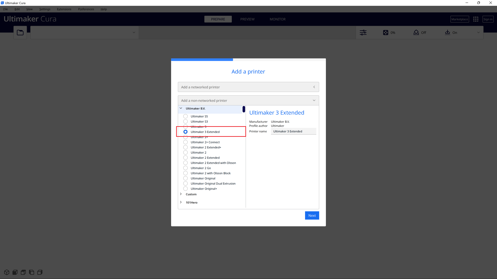

### Cura Interface

Lets go through the interface of Cura in brief.

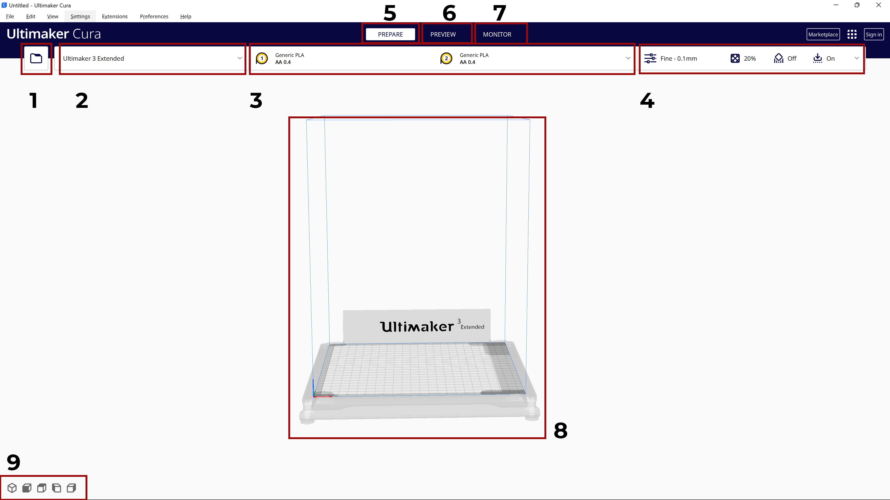

1. The first area deals with importing files into Cura. More often than not, STL file formats are used to import 3D models to postprocess in Cura.
2. The second region is where one can select the 3D printer type. Once set, this setting is rarely touched.
3. The third region deals with material selection, and thickness of the material. When a material is changed in the 3D printer, one should do the relevant changes in this menu.
4. The fourth region deals with setting layer heights, support layer settings, and other fine tuning one does when slicing the model. This menu is the one that is most often used when using Cura.
5. `PREPARE` is where one spends the most time tweaking the slicing settings.
6. `PREVIEW` can be used to preview the sliced model after the settings are finalized in teh PREPARE tab.
7. The `MONITOR` tab is used for networked devices, where one is able to see the live view of the 3D printer in action while it is being printed.
8. This region is where the models are viewed and arranged on the print bed.
9. This region can be used to change views of the 3D model in the 8th region.

### Navigating through Cura's Interface

-   To pan around the object, hold down the middle mouse button and move the mouse.
-   To rotate around the object, hold down the right mouse button and move the mouse.

### Slicing and Exporting from Cura

This section goes through importing materials to Cura, tuning layer and support settings, material settings, and methods to export to Ultimaker printer.

1. The STL model can be dragged into Cura's interface, or can be opened through Cura (CMD+O for Mac, CTRL+O for Windows).
2. Once the model is imported, and if it is clicked on, new settings show up in the interface. One can scale, transform, and do other operations through these options. 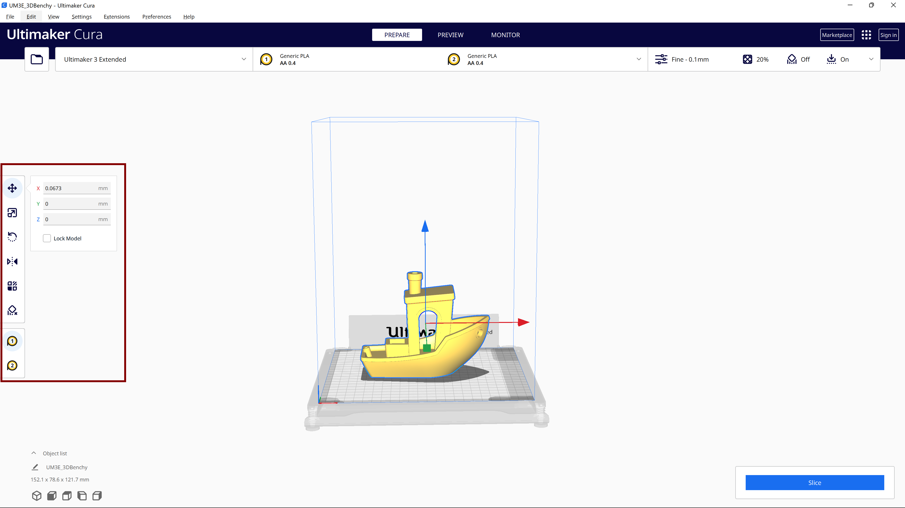
3. The model's position can be adjusted by using the arrows on the interface.
4. In a similar way, the model's scaling can be adjusted by choosing the 2nd icon on the options to the left. 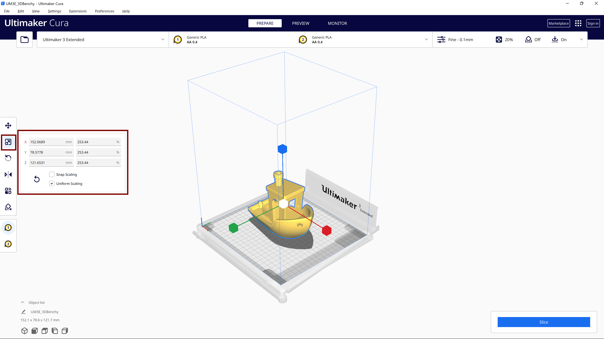Pushing and pulling the handles on the interface decreases and increases the size of the model to be printed.
5. The orientation can be be adjusted using the third icon on the left menu. The handles can be rotated around the model to adjust the orientation. 
6. After the desired orientation, scaling, and position are set, one can proceed to set the layer settings. 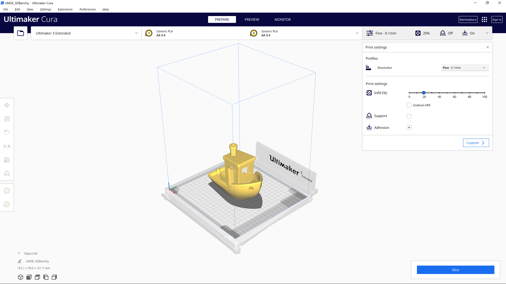
7. The resolution decides the layer height of the model. The higher the resolution, the higher quality of the end product is, but it takes longer as it has to print finer layers. One has to decide the tradeoff between the time of print and the quality of the end product. 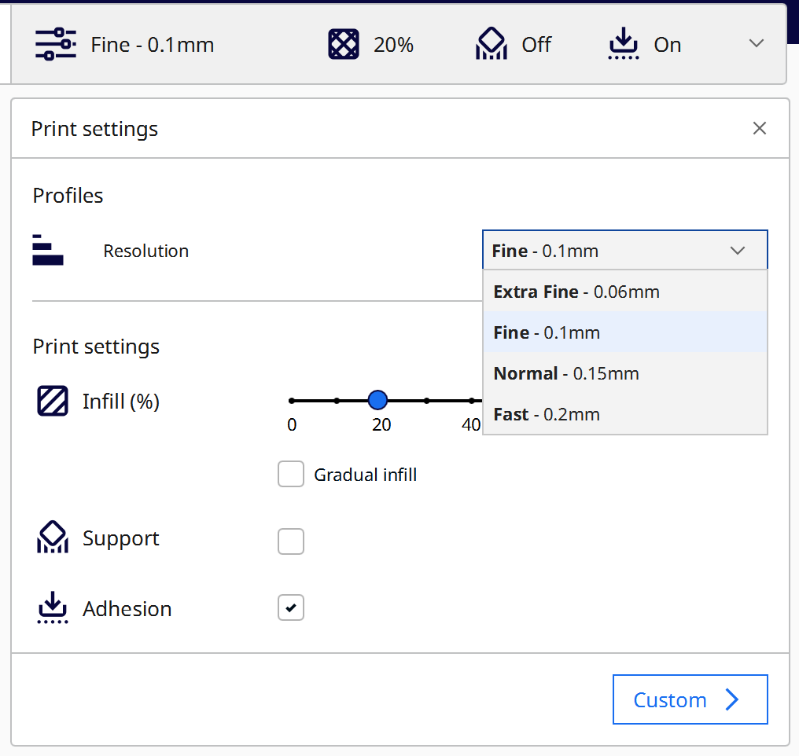 If one wants a quick prototype, the `Fast` option has to be chosen, and if its the final iteration, `Fine` option can be chosen for higher quality.
8. If one wants to prototype faster than the above settings, visit [this page](../../how_to/print_faster.md) that details more in-depth settings to be changed that allows faster prints than what is achievable through the standard settings.
9. The infill settings decides the amount of plastic to be used inside the print. Higher infill settings lead to heavier and stronger models, but will take longer to print and consume more materials. A good standard infill setting is 40%, and can be adjusted according to the need.
10. One should be careful to check the `Support` option incase the material has any overhangs. Not checking this option might lead to failed prints that has overhangs. 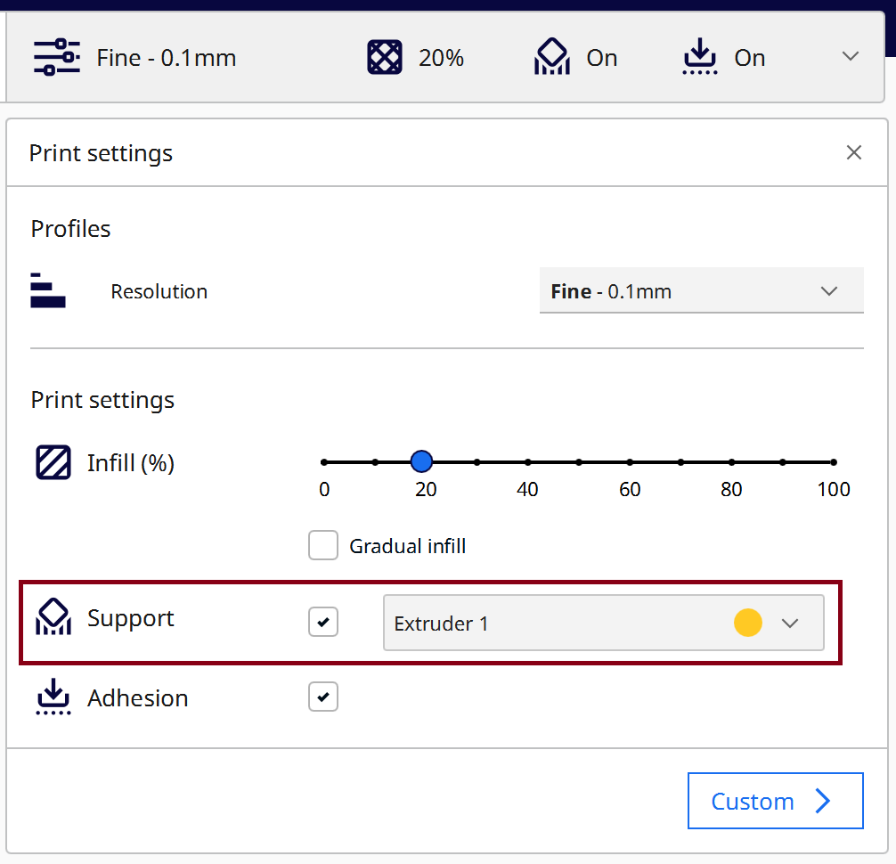
11. The Adhesion option prints an extra rim around the model to make sure the print sticks to the bed. Leaving this option on would reduce the probability of the print failing, but one would have to spend more time removing the extra rim using the deburring tool.
12. After the layer settings are finalized, start the slicing process by clicking the slice button. 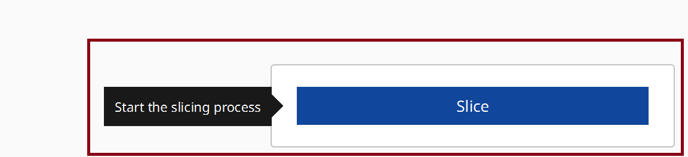
13. After the slicing is processed, insert a USB stick to the computer. The sliced model can be sent to the USB directly from Cura itself. 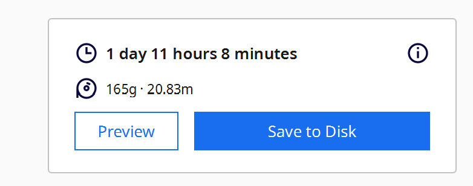 Save the model to the disk in the `.gcode` format, and eject the USB stick from the computer. The USB now contains the model that can be inserted into the Ultimaker.

### Printing the Sliced model with Ultimaker

After copying the required .gcode files to the USB stick, follow the following steps to print the model in the Ultimaker.

1. Make sure there is enough material in the Ultimaker for the print before starting the print. If the Ultimaker runs out of material, there is no way to add additional material for continuing the print, and one would have to restart the whole print with new material.
    1. Ultimaker doesn't have a mechanism that notifies one if the existing spool is enough for the model it is about to print, so one has to use their judgement to decide if the existing material is enough for the print.
       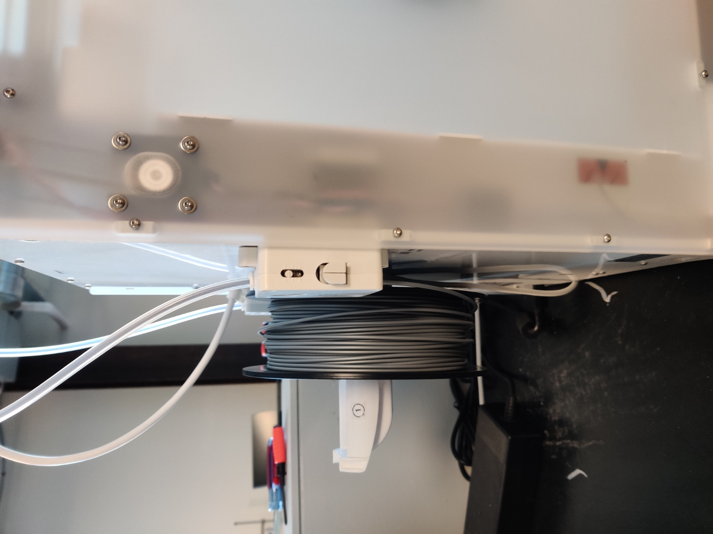
2. Insert the USB into Ultimaker. The dial can be rotated to scroll through the options on the screen, and can be pressed to select. Select print, and the right file from the following options.  
   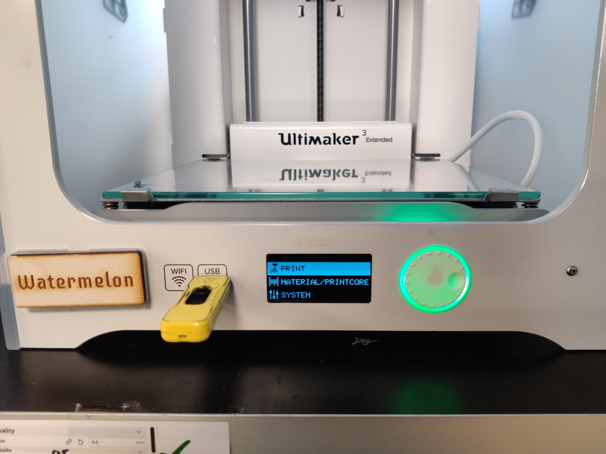
   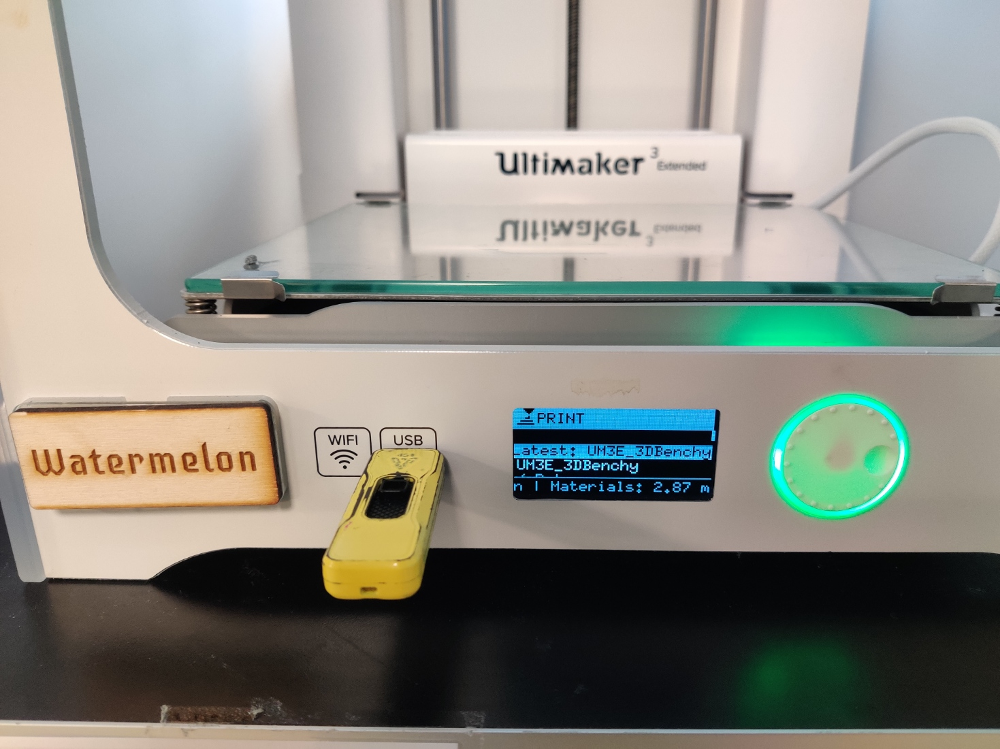
3. Wait till the Ultimaker heats up the build plate and the print core.
   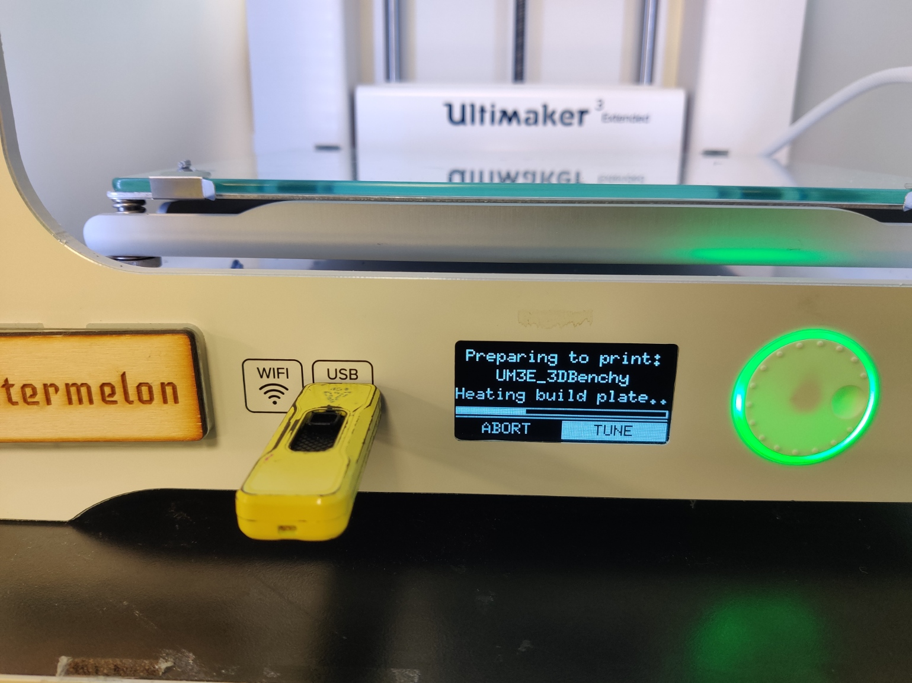
   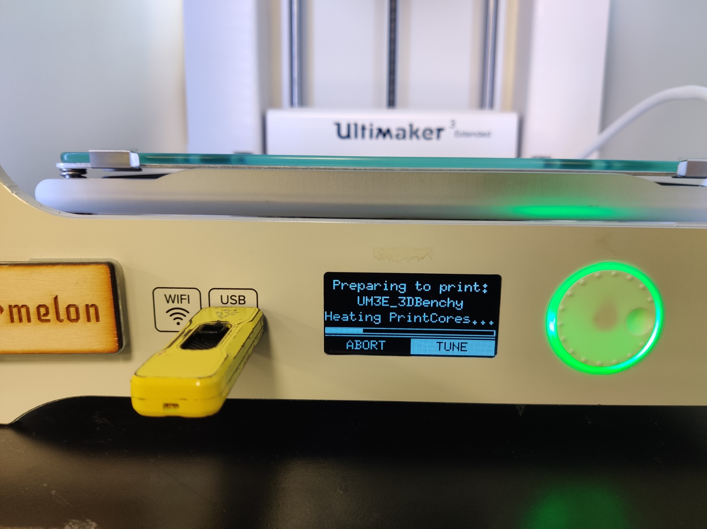
4. As the first step in the print, the Ultimaker squirts a small amount on the corner of the build plate. The shape has to be roughly pyramidal.
   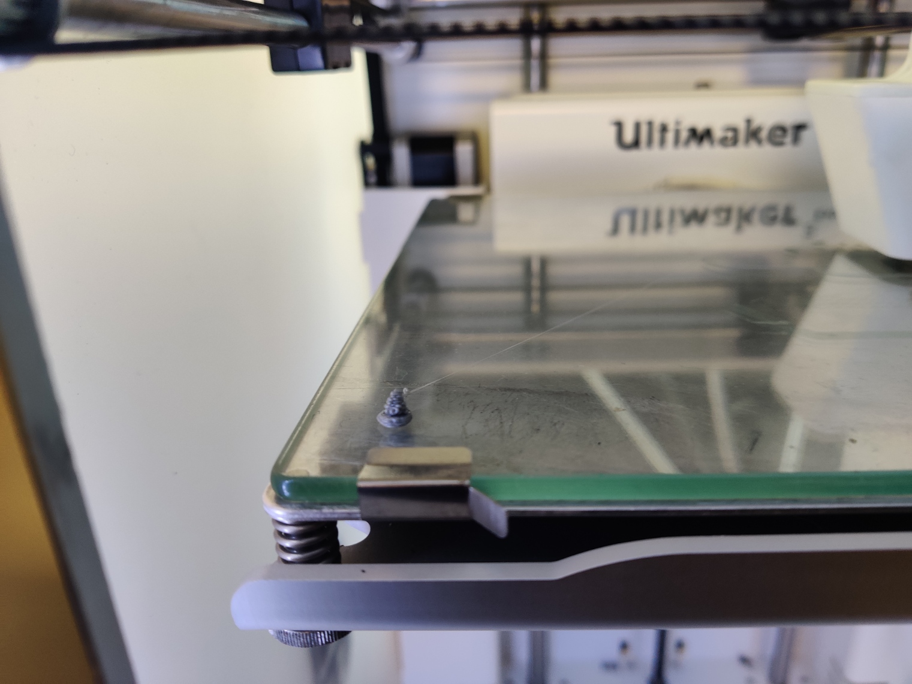
5. When the print starts, make sure the rims for the print are evenly shaped and sticks to the plate. Also, make sure the flow from the nozzle is consistent. These steps ensure that the rest of the print continues to go well.
   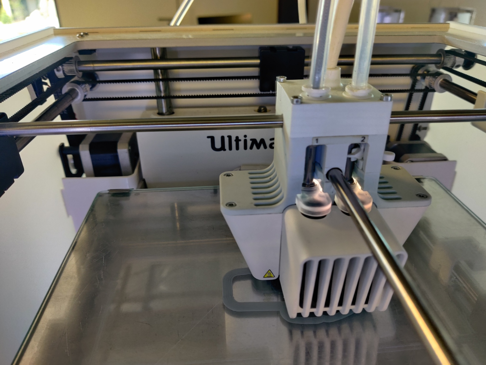
6. There are always chances that the print might fail at any point, and following the above initial steps reduces the probability of the print failing, as one can identify faults at the beginning itself rather than later.
7. Remove the print from the glass pane using a spatula. The supports can be removed using a plier, and the rims can be removed using a deburring tool.
